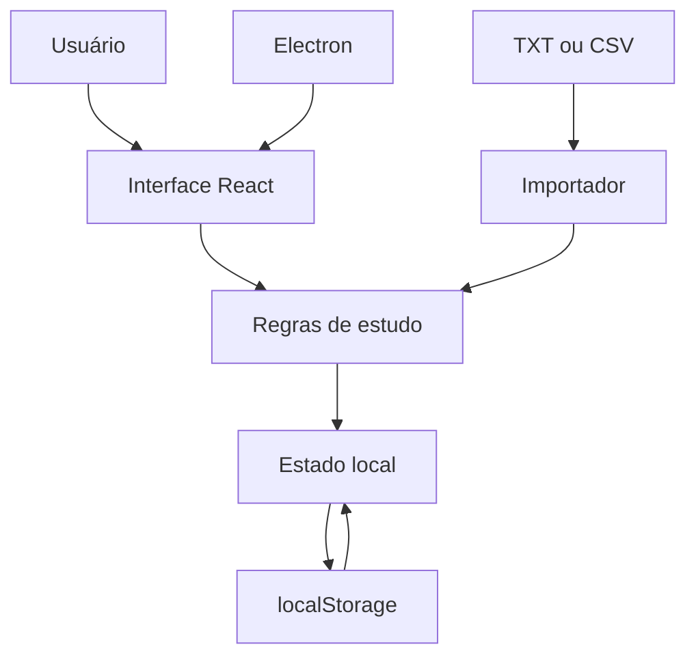

# Arquitetura do AlkaStudy

## Visão geral

O AlkaStudy adota, na versão 1.0.0, uma arquitetura desktop local orientada a componentes. O aplicativo separa o invólucro desktop, a interface, as regras do domínio e a persistência local. Essa decisão reduz a dependência de infraestrutura externa e permite o uso sem conexão com a internet.

## Componentes

1. **Processo principal do Electron:** inicializa o aplicativo, configura a janela, aplica isolamento de contexto e carrega os arquivos compilados.
2. **Camada de apresentação React:** renderiza cadastro, painel, biblioteca, editor, revisão, troféus, estatísticas e configurações.
3. **Domínio de estudo:** representa perfil, baralho, carta, histórico de revisão, ritmo diário, XP, nível e troféu.
4. **Persistência local:** serializa o estado em `localStorage`, com migração das chaves utilizadas por versões anteriores.
5. **Importador:** converte linhas de TXT/CSV em cartas e aplica uma lista controlada de marcações de texto.

## Fluxo de dados

## Modelo de dados essencial

- `Profile`: nome, objetivo, ritmo e meta diária;
- `Deck`: identificador, nome, descrição, data de criação e cartas;
- `Card`: pergunta, resposta, vencimento, intervalo, total de revisões e histórico;
- `ReviewLog`: avaliação, instante da resposta, próxima data e intervalo;
- `Store`: perfil, baralhos, XP, sequência e contagem diária.

## Revisão espaçada

Ao avaliar uma carta, o sistema usa o horário local da máquina. A avaliação **De novo** agenda dez minutos; **Difícil**, pelo menos um dia; **Bom**, pelo menos dois dias; e **Fácil**, pelo menos quatro dias. Nos acertos, o intervalo cresce conforme o histórico da carta. A sessão seguinte filtra apenas cartas cujo campo `due` seja menor ou igual ao instante atual.

Cada resposta persiste:

- avaliação escolhida;
- data e hora da resposta;
- intervalo em minutos;
- data e hora da próxima revisão;
- histórico limitado às cem avaliações mais recentes da carta.

## Gamificação

Cada resposta gera 10 XP. O modelo atual considera 50 questões por nível, até o nível 100, e libera um troféu a cada 500 questões, totalizando dez troféus na coleção principal. A meta diária pode seguir os ritmos Casual, Regular, Intensivo e Maratonista ou ser personalizada.

## Segurança e privacidade

O Electron utiliza `contextIsolation`, desabilita `nodeIntegration` na interface e mantém `sandbox` ativo. Links externos são abertos fora da janela do aplicativo. A renderização de texto enriquecido restringe as marcações aceitas para reduzir o risco de execução de conteúdo importado.

Como os dados permanecem no dispositivo, não há envio automático de informações pessoais a um servidor. Entretanto, `localStorage` não substitui um banco transacional nem uma estratégia de backup. Uma evolução recomendada é migrar a persistência para SQLite, com exportação e restauração de backup.

## Decisões e limitações

- **Offline primeiro:** favorece privacidade e disponibilidade, mas impede sincronização entre dispositivos.
- **Persistência simples:** acelera o protótipo e a avaliação do TCC, mas exige evolução para volumes maiores.
- **Electron:** reaproveita tecnologias web, com custo de memória superior ao de soluções nativas.
- **Algoritmo próprio:** torna as regras transparentes, mas requer validação com usuários e comparação com algoritmos consolidados.
- **APKG:** aparece como formato planejado, mas sua leitura completa ainda não integra esta versão.

## Evoluções sugeridas

- persistência SQLite com migrações e backup;
- importação APKG com tratamento de mídias;
- testes unitários para agendamento e migração;
- testes de usabilidade com estudantes;
- acessibilidade por teclado e leitores de tela;
- exportação de relatórios para pesquisa acadêmica;
- distribuição assinada e atualização controlada.
